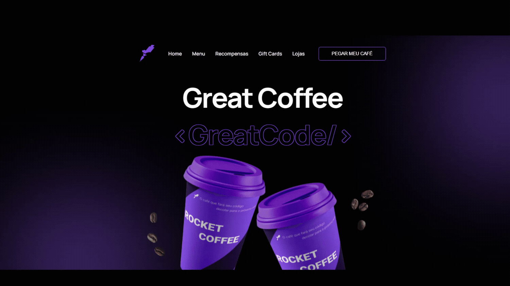

# <h1 align=center><strong>ROCKETCOFFEE ☕🚀</strong></h1>

<h2 align=center>Criação de uma página para adquirir um café, desafio proposto no programa Discover da RocketSeat.</h2>

<h3 align=center><strong> Você pode conferir o projeto <a href='https://tthayza.github.io/rocket-coffee/' target='_blank'>clicando aqui</a>! 💫</h3></strong>

 

A página conta com um <em>nav-bar</em> que possui uma logotipo, um menu de navegação e um botão para pegar o café que junto ao menu de navegação contém efeitos hover. Além disso, foi trabalhado principalmente com a questão de posicionamentos dos elementos de sombra para que ficassem de acordo com o protótipo do projeto e a depender da interface <em>desktop</em> ou <em>mobile</em>, o layout deve mudar. Sendo assim, um projeto com responsividade de acordo com a tela do usuário.

 

  

#### <h3 align="center"> Esse projeto foi desenvolvido com </h3>

### 
 **HTML | CSS | JavaScript | Figma | Git | GitHub** 

### <h3 align="center"> [Acesse meu perfil no Linkedin aqui](https://www.linkedin.com/in/tthayza-oliveira/) </h3>
